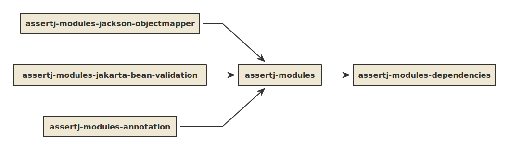

 &nbsp;

# assertj-modules

AssertJ Modules are [AssertJ](https://assertj.github.io/doc/) fluent 
assertion extension libraries that can be utilized by your project for 
speed of development and testing. 

## Modules

- assertj-modules-jackson-objectmapper
- assertj-modules-jakarta-bean-validation
- assertj-modules-annotation

### Project Structure
[View Source](http://www.nomnoml.com/#view/%23font%3A%20Calibri%0A%23fontSize%3A%2012%0A%23spacing%3A%2050%0A%23padding%3A%2015%0A%23fillArrows%3A%20false%0A%23arrowSize%3A%20.8%0A%23lineWidth%3A%202%0A%23edgeMargin%3A%208%0A%23leading%3A%201%0A%23stroke%3A%20%2333322E%0A%23direction%3A%20right%0A%23acyclicer%3A%20greedy%0A%23zoom%3A%20.8%0A%23title%3A%20project-structure%0A%0A%5Bassertj-modules%5D-%3E%5Bassertj-modules-dependencies%5D%0A%5Bassertj-modules-jackson-objectmapper%5D-%3E%5Bassertj-modules%5D%0A%5Bassertj-modules-jakarta-bean-validation%5D-%3E%5Bassertj-modules%5D%0A%5Bassertj-modules-annotation%5D-%3E%5Bassertj-modules%5D%0A)

### Documents

- [Contribution Guidelines](docs/CONTRIBUTION.md)
- [Development Notes](docs/DEVELOP.md)
- [Release Process](docs/RELEASE.md)
